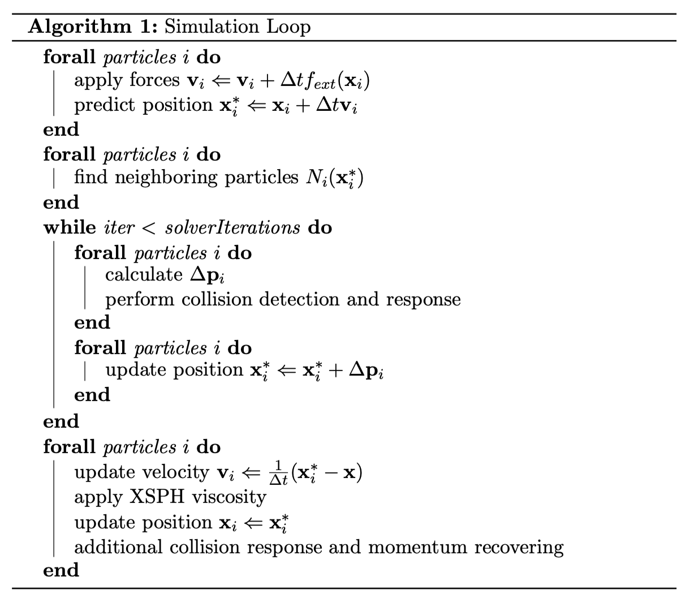
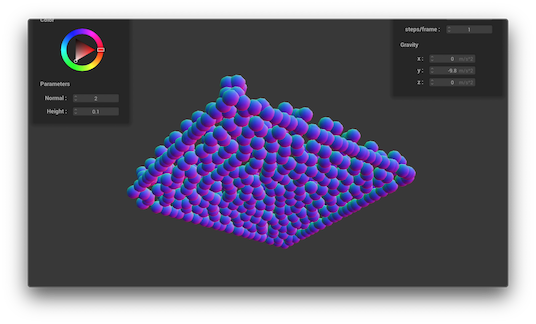
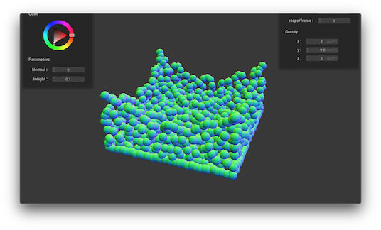
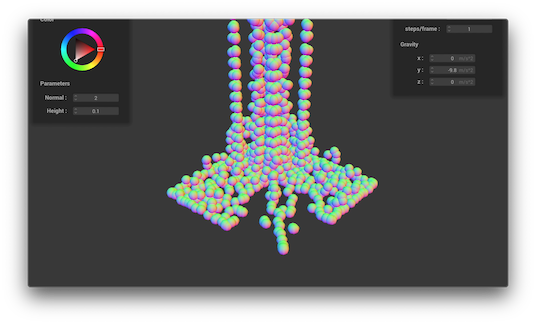
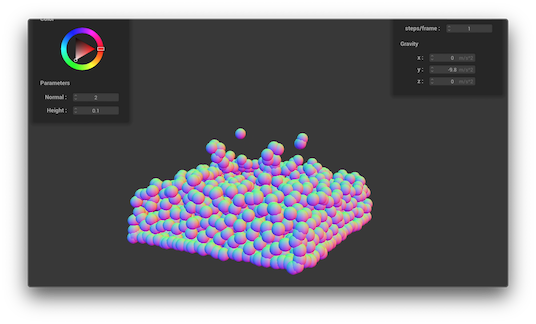
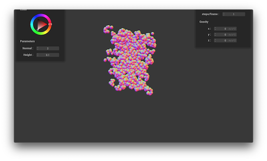

# Position Based Fluid

## Abstract

The projects aims to implement a real-time rendering of liquid 
simulation using a particle-based method. The fluid is represented by a 
underlying mesh of particles, and in each iterations, we enforce 
incompressibility by introducing by formulating and solving a set of 
positional constraints that enforce constant density \[1\]. 

## Technical Approach

The code is modified from 
[project 4 skeleton code of Berkeley CS 184](https://github.com/cal-cs184/p4-clothsim).

The algorithm is mostly based on Macklin and Muller's *Position Based 
Fluids* \[1\] as follows:

The original paper contains incompressibility, tensile instability, 
vorticity confinement and viscosity constraints. Due to time limitation, 
we did not implement the vorticity constraint. 

### Neighbor Searching

The neighbor searching algorithm is done by creating a position hash of 
all particles before each simulation loop. Each position is mapped to a 
block whose side is equal to the kernel radius. When searching for the 
neighbors of a given position, we iterate through the 3x3x3 blocks 
centered by corresponding block of the input position. 

### Constraint Solver

The constraints are solved using a iterative density solver, trying to 
change the position of each particle so that all particles are close to 
their rest density. The isotropic kernel function is defined as 

\\[  W(\mathbf{r}, h) = {315 \over 64 \pi h^9} (h^2 - \lvert \mathbf{r} \rvert^2)^3 \\]

and we used the "spiky" kernel as its gradient to avoid vanishing 
gradient near zero. "Spiky" is defined as:

\\[ \nabla \mathbf{W}(\mathbf{r}, h) = -{45 \over \pi h^6} (h - \lvert \mathbf{r} \rvert)^2 \hat \mathbf{r} \\]

For each particle, we have \\( \rho_0 \\) as its rest density, and its 
current density is estimated using the SPH estimator:

\\[ \rho_i = \sum_{j \in N_i} m_j W(\mathbf{p}_i - \mathbf{p}_j, h) \\]

where \\( N_i \\) is the neighbor set of particle \\( i \\). 

The incompressible constraint is modeled as 

\\[ C_i = {\rho_i \over \rho_0} - 1 \\]

and we want to search for a displacement vector \\( \delta \mathbf{p}_i \\)
so that 

\\[ C_i (\mathbf{p} + \delta \mathbf{p}) = 0, \forall i \\]

This is solved using Newton's method:

\\[ \delta \mathbf{p}_i = {1 \over \rho_0} \sum_{j \in N_i} (\lambda_i + \lambda_j) \nabla \mathbf{W}(\mathbf{p_i} - \mathbf{p_j}, h) \\]

where

\\[ \lambda_i = - {C_i \over \sum_k \lvert \nabla_{\mathbf{p}_k}} C_i \rvert + \varepsilon \\]

in which \\( \varepsilon \\) is an artificial term added for stability.

### Tensile Instability

We introduce an artificial pressure as

\\[ s_\mathrm{corr} = -k \left( W(\mathbf{p}_i - \mathbf{p}_j, h) \over W(\nabla \mathbf{q}, h) \right)^n \\] 

and change the displacement calculation in the previous section into

\\[ \delta \mathbf{p}_i = {1 \over \rho_0} \sum_{j \in N_i} (\lambda_i + \lambda_j + s_\mathrm{corr}) \nabla \mathbf{W}(\mathbf{p_i} - \mathbf{p_j}, h) \\] 

This improves the cramming problem that will be discussed in the 
following sections by a little bit

### XPH Viscosity

After the velocity update, we apply XPH viscosity by updating

\\[ \mathbf{v}_i^* = \mathbf{v}_i + c \sum_{j \in N_i} (\mathbf{v}_j - \mathbf{v}_i) \cdot W(\mathbf{p}_i - \mathbf{p}_j, j) \\]

### Particles Cramming

The biggest obstacle during our implementation is the problem of 
particles cramming and loosing momentum after collision. Our original 
collision algorithm is done by moving the colliding particle from its 
previous position to the collision surface with a friction factor, but 
this method does not take the velocity of the particle into position. 
Thus, the particles that fall from a high distance loss most of its 
momentum since we are doing a position-based dynamic system. Our 
solution is to use a velocity-based collision, and each surface will 
reflect a colliding particle back corresponding to its previous velocity 
instead of position. 

*Particles cramming due to a loss of momentum (Click on image for video).*

Additionally, since we did not implement vorticity constraints, the 
particles suffer from momentum loosing and sticking to the collision 
surfaces. The tensile instability constraints help with the problem but 
not fully solve it. Thus, we added an additional collision detection 
after the constraint solver, and gives colliding particles that are 
nearly still an artificial velocity away from the collision surfaces. 
This allows the particles to have a tendency to move away from cramming 
after the collision.

To speed up the simulation, we resolve to OpenMP but the effect is 
limited except for on Linux.

## Results

*A cube of liquid dropping into a slight larger container (Click on image for video).*

*A column of water dropping into the corner of a container (Click on image for video).*

*An attempt to simulate the "milk crown" effect (Click on image for video).*

*Water particles without gravity (Click on image for video).*

## Future Works

We could reconstruct a triangular mesh from the existing particle mesh 
to get a more realistic water representation. We can also add the ray
tracing functionality to show the reflection of refraction of the liquid. 

The liquid simulation could be rewrite along with GPU acceleration. 
Since in the iterative constraint solver, all calculation on the 
particles are independent, they can all be run in parallel and speed up 
by a large factor. 

Also, it could potentially be possible that the constraint solve can be 
speed up using a machine learning method, the majority of the time spent 
is on the solver. The idea behind the current iterative solver is 
similar to gradient descent, we could potentially run a large number of 
iterations until convergence, feed the data into a neural net, and 
possibly get a fast well-performing solver.

## Reference

\[1\] Macklin, Miles, and Matthias Müller. "Position based fluids." ACM 
Transactions on Graphics (TOG) 32.4 (2013): 104.

## Contributions

- Fanyu Meng: Port the skeleton from skeleton code and implemented the 
simulate loop and the physics system. 
- Collin Cao: Enabled OpenMP to speed up the simulation. Helped with the 
    idea of velocity-based collision and parameter tuning. 
- Serena Wu:Enabled OpenMP to speed up the simulation. Helped with the 
    idea of velocity-based collision and parameter tuning. 
